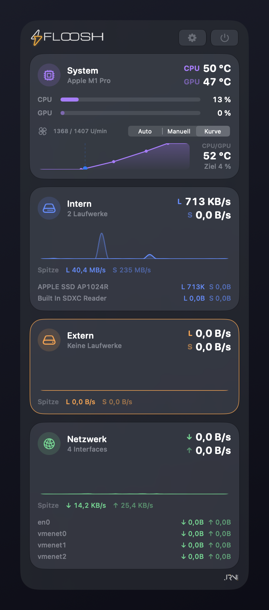
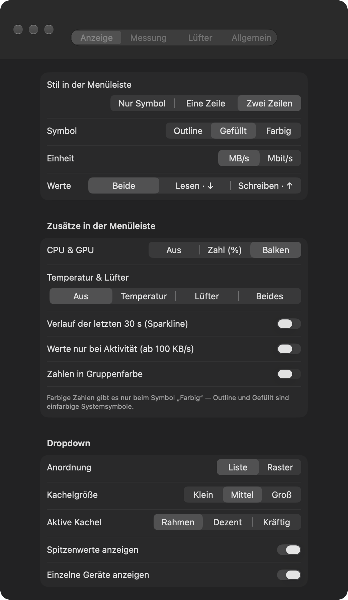
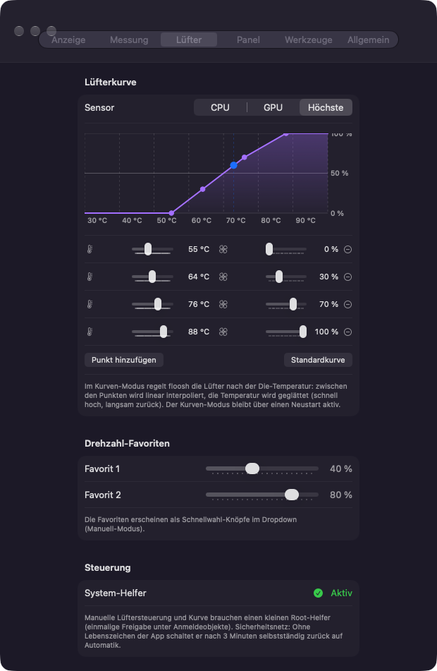
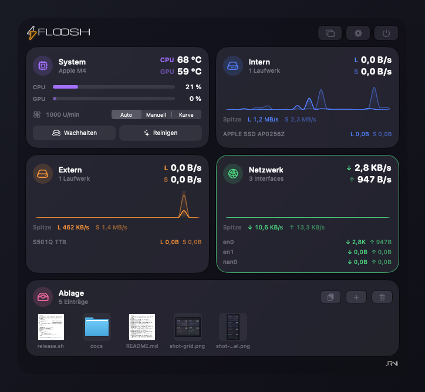
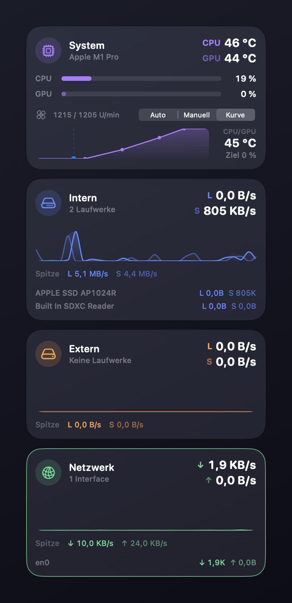
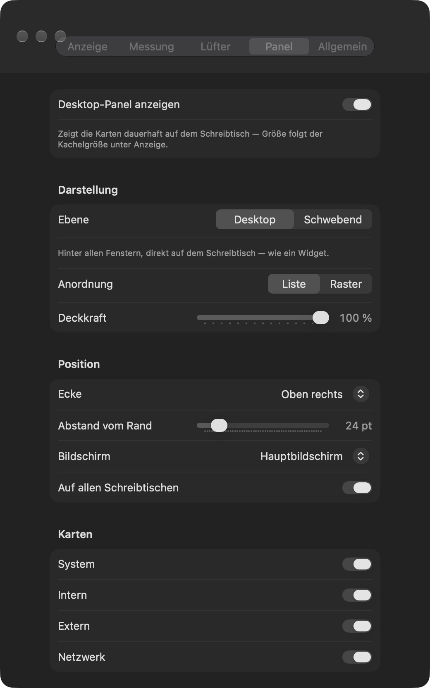
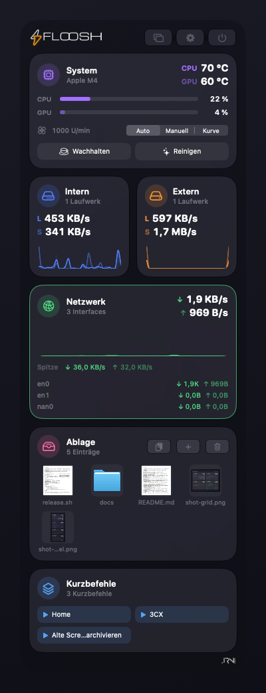
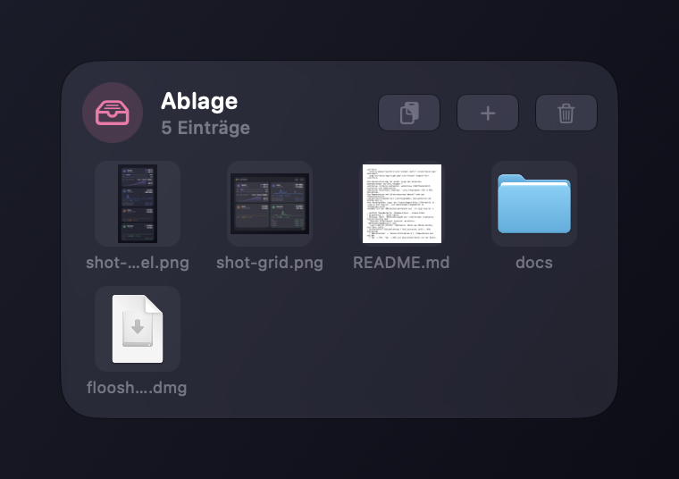

<picture>
  <source media="(prefers-color-scheme: dark)" srcset="docs/logo-dark.png">
  
</picture>

Mini-Menüleisten-App für macOS: zeigt den aktuellen Datendurchsatz von drei Gruppen —
**Intern** (interne Laufwerke), **Extern** (USB/Thunderbolt-Laufwerke) und **Netzwerk**
(physische Interfaces, Down/Up) — plus **System**: CPU- & GPU-Auslastung,
Die-Temperaturen und Lüftersteuerung (manuell oder per Temperaturkurve).
Liquid-Glass-Dropdown mit Live-Diagrammen, Spitzenwerten und Geräteliste in
drei Kachelgrößen. Logo: der floosh-Doppel-Blitz (SVG-Quelle in
`Logo & Icon Source/`, als Vektorpfade eingebettet in `BrandLogos.swift`,
zusammen mit der JRN.digital-Wortmarke aus `jrn Logo Source/`).

- SwiftUI · eigener `NSStatusItem` (`MenuBarWindow.swift`) · Liquid Glass (`glassEffect`) · Swift Charts
- Messung: IOKit `IOBlockStorageDriver`-Statistiken (Laufwerke, Klassifizierung über
  `Physical Interconnect Location` am Eltern-`IOBlockStorageDevice`) und
  `sysctl NET_RT_IFLIST2` (Netzwerk). Raten aus Zähler-Deltas, kein Root nötig.
- System-Karte: CPU-Auslastung (`host_processor_info`), GPU-Auslastung
  (`IOAccelerator` → `Device Utilization %`), Temperaturen aus dem SMC
  (`Tp*` = CPU, `Tg*` = GPU; pro physischem Sensor nur der Basis-Key der
  Dreiergruppe, die übrigen sind Kalibrier-Offsets), Lüfter über `F#Ac/Mn/Mx/Tg/Md`.
- Lüftersteuerung Auto/Manuell/Kurve: Manuell = Schieberegler 0–100 % (zwischen
  Min- und Max-RPM) plus zwei Drehzahl-Favoriten (Rechtsklick auf den Knopf
  speichert den aktuellen Regler-Wert). Kurve = Stützpunkte °C → % (linear
  interpoliert, Sensor CPU / GPU / Höchste), die App wertet sie bei jeder
  Messrunde aus und schickt dem Helper nur geänderte Zielwerte; die Temperatur
  wird asymmetrisch geglättet (schnell hoch, langsam zurück), damit nichts
  flattert. Der Kurven-Modus überlebt als einziger einen Neustart. SMC-Schreiben
  braucht Root → `FlooshFanHelper` als LaunchDaemon im Bundle
  (`SMAppService.daemon`, einmalige Freigabe unter Anmeldeobjekte, App muss
  dafür in `/Applications` liegen); der Helper kennt keine Kurve und bleibt die
  minimale Root-Komponente. Sicherheitsnetz: ohne Ping der App stellt er nach
  3 Minuten selbstständig auf Automatik zurück; auch beim Beenden der App wird
  die Regelung zurückgegeben.
- Menüleisten-Label: nur Symbol / eine Zeile / zwei Zeilen, Symbol-Stil Outline /
  Gefüllt / Farbig (Gruppenfarbe), Werte beide / nur Lesen / nur Schreiben.
  Zusätze: CPU & GPU zweizeilig als Prozentzahl oder Mini-Balken, Temperatur
  und/oder Lüfterdrehzahl, Sparkline der letzten 30 s, „Werte nur bei
  Aktivität" (unter 100 KB/s nur das Symbol), Zahlen in Gruppenfarbe. Alles
  als `NSImage` gerendert — MenuBarExtra stellt mehrzeilige SwiftUI-Labels
  nicht dar und erzwingt sonst Template-Rendering.
- Gruppe wählen: Klick auf eine Karte im Dropdown; die aktive Karte wird per
  Rahmen, dezenter Tönung oder kräftig markiert (einstellbar). Anordnung:
  **Liste** (alles untereinander), **Geteilt** (Intern und Extern als zwei
  Quadrate nebeneinander — spart rund 190 pt Höhe, gleiche Fensterbreite) oder
  **Raster** (alle Karten paarweise, doppelte Breite). Die Zeilenaufteilung
  liegt in `DashboardCard.rows(_:layout:)` und gilt für Dropdown und Panel;
  halbbreite Karten rendern kompakt (Werte unter dem Titel, kein Geräte-Teil).
- Einstellungen in eigenem Fenster (⌘, / Zahnrad) mit Tabs **Anzeige · Messung ·
  Lüfter · Panel · Allgemein**: Stil, Symbol, Einheit MB/s / Mbit/s, Menüleisten-Zusätze,
  Anordnung, Kachelgröße Klein/Mittel/Groß, Markierung der aktiven Kachel,
  Intervall 0,5–2 s, Diagramm-Fenster 30–120 s, Quellen-Toggles,
  Lüfterkurven-Editor (Sensor, bis zu 8 Stützpunkte, Live-Marker),
  Lüfter-Favoriten & Helper-Status, Ablage, Login-Start (`SMAppService`),
  Update-Check.
- Desktop-Panel (`DesktopPanel.swift`): rahmenloses, transparentes `NSPanel`
  mit denselben Karten — auf Desktop-Ebene (`desktopIconWindow − 1`, hinter
  allen Fenstern, auf allen Schreibtischen) oder `.floating`. Ecke + Randabstand,
  Deckkraft, Liste/Raster, Kartenauswahl, Ziel-Bildschirm; Fenstergröße folgt
  dem SwiftUI-Inhalt (`sizingOptions = .preferredContentSize`), danach wird
  an der Ecke neu ausgerichtet. Schalter im Dropdown-Kopf und Tab **Panel**.
- Menüleiste (`MenuBarWindow.swift`): eigener `NSStatusItem` statt `MenuBarExtra`.
  Nötig fürs Ziehen — das Fenster von `MenuBarExtra` schließt sich, sobald eine
  andere App aktiv wird, und es gibt seinen Statusknopf nicht heraus. Eine
  unsichtbare `StatusDropView` über dem Knopf nimmt Klicks und Datei-Drags an
  und klappt das Fenster beim Darüberziehen auf (Spring-Loading); das Fenster
  ist ein `NSPanel` (`.nonactivatingPanel`, Level `.popUpMenu`), das per Klick
  daneben, Escape oder erneutem Klick schließt. Auch das Einstellungsfenster
  gehört jetzt der App (`SettingsWindowController`) — `showSettingsWindow:`
  meldet in dieser Konstellation Erfolg, öffnet aber nichts.
- Ablage (`FileShelf.swift`, `ShelfCard.swift`): Dateien kurz parken — als Karte
  im Dropdown und im Desktop-Panel. Hinein per Ziehen auf das Menüleisten-Symbol
  oder irgendwo ins Fenster (`dropDestination`), über die
  Dateiauswahl oder aus der Zwischenablage; heraus per `NSItemProvider(contentsOf:)`,
  also als echte Datei-Referenz in Finder und andere Apps. Vorschaubilder aus
  QuickLook (`QLThumbnailGenerator`, als PNG-Daten über die Isolationsgrenze),
  gespeichert werden Bookmarks — Umbenennen und Verschieben verlieren den Eintrag
  nicht, Gelöschtes wird orange markiert. Kopiert wird nichts, max. 20 Einträge.
- Update-Hinweis: `UpdateChecker` fragt beim Start und alle 6 Stunden die
  GitHub-Releases-API (`releases/latest`) ab und vergleicht das Tag mit der
  Bundle-Version; neue Versionen erscheinen als Zeile im Dropdown und unter
  Allgemein (Laden = DMG-Asset, Überspringen merkt sich die Version). Kein
  Auto-Install.
- Feature-Katalog (`Features.swift`): jedes Feature hat eine Stufe (heute alle
  frei); Einstellungs-Einstiege laufen über `featureGated`, damit eine spätere
  Pro-Variante nur dort ansetzt.

## Screenshots

<p>
  
  &nbsp;&nbsp;
  
</p>
<p>
  
</p>
<p>
  
</p>
<p>
  
  &nbsp;&nbsp;
  
</p>
<p>
  
  &nbsp;&nbsp;
  
</p>

## Bauen

```bash
./bundle-app.sh
```

Ergebnis: `build/floosh.app` (Release, ad-hoc-signiert, `LSUIElement`).
Installieren: nach `/Applications` kopieren — oder gleich den Installer bauen:

```bash
./Tools/make-dmg.sh
```

Ergebnis: `build/floosh-<version>.dmg` (App + Applications-Verknüpfung).
Die Versionsnummer kommt aus `VERSION`, die Build-Nummer ist die Commit-Anzahl.

## Release

```bash
./Tools/release.sh
```

Baut das DMG, setzt den Tag `v<version>`, pusht und legt das GitHub-Release
mit dem DMG als Asset an (Notizen aus `docs/releases/<version>.md`, sonst
generiert; `--notes "…"` bzw. `--dry-run` möglich). Der Update-Check der App
erkennt genau diese Releases.

Mindestsystem: macOS 14 (Sonoma), Universal Binary (Apple Silicon + Intel).
Liquid Glass gibt es ab macOS 26 — davor rendert dieselbe App eine
Material-Optik (`GlassCompat.swift`). Kein Sandbox-Entitlement nötig.

## Hinweise

- „Netzwerk" misst Interface-Durchsatz (`en*`) — deckt auch Netzlaufwerk-Traffic ab.
  SMB/NFS-Volumes haben keine per-Volume-Zähler ohne Root.
- Interfaces ohne jeglichen bisherigen Traffic (XHC*, tote en*) werden ausgeblendet;
  VPN/virtuelle Interfaces (utun*, awdl* …) optional zuschaltbar.
- SMC-Structs müssen dem 80-Byte-C-Layout des Kernels entsprechen — inklusive
  der 3 Pad-Bytes hinter `SMCKeyInfoData` (sonst sind alle Keys „nicht lesbar").
- Lüfterlose Macs (MacBook Air): `FNum` = 0, die Lüfter-Sektion wird ausgeblendet.
- Die Marken-Logos werden mit fester „Logo-Tinte" gefüllt (weiches Weiß bzw.
  Anthrazit je nach Erscheinungsbild) — `.primary` wird auf Liquid Glass durch
  Vibrancy so stark abgedunkelt, dass die Logos kaum sichtbar waren.
- Disk-Images (`Virtual Interface`) zählen optional zu „Intern" (Standard: aus,
  vermeidet Doppelzählung).
- Synthetische AppleScript-Klicks öffnen MenuBarExtra-Fenster unter macOS 26 nicht —
  für UI-Tests echte CGEvent-HID-Klicks verwenden. Alternativ die Dev-Hooks:
  `floosh --snapshot <ordner>` rendert Dropdown + Label-Varianten offscreen als
  PNG (ohne Glas), `floosh --shoot` zeigt Dropdown/Einstellungen in echten
  Fenstern (echtes Liquid Glass) und meldet Region/Fenster-ID auf stdout für
  ein externes `screencapture` — so entstanden die README-Screenshots
  (`--shoot settings` nur das Einstellungsfenster, `--shoot panel` das
  Desktop-Panel, `--shoot menu` das echte Menüleisten-Fenster,
  `--open-settings` das Einstellungsfenster über denselben Weg wie das
  Zahnrad). **`--shoot` bildet das Menüleisten-Fenster nicht nach** — es setzt
  seine Größe selbst; Änderungen am Dropdown-Aufbau nur mit `--shoot menu`
  prüfen.
- App-Icon wird per `Tools/make-icon.sh` aus den Marken-Pfaden in
  `BrandLogos.swift` generiert (Navy-Kachel + Doppel-Blitz) und liegt als
  `AppIcon.icns` im Repo.
- `BrandLogos.swift` wurde aus den SVGs konvertiert (SVG-Pfaddaten →
  SwiftUI-`Path`); bei Logo-Änderungen die SVGs austauschen und neu
  konvertieren, nicht die Pfade von Hand editieren.

## Lizenz

[MIT](LICENSE) — © 2026 JRN.digital. Ausgenommen sind die Marken: das
floosh-Logo/Doppel-Blitz, die floosh-Wortmarke und die JRN.digital-Wortmarke
(`Logo & Icon Source/`, `jrn Logo Source/`, `BrandLogos.swift`, `AppIcon.icns`)
dürfen nicht für eigene Produkte oder Forks als Kennzeichen verwendet werden.
